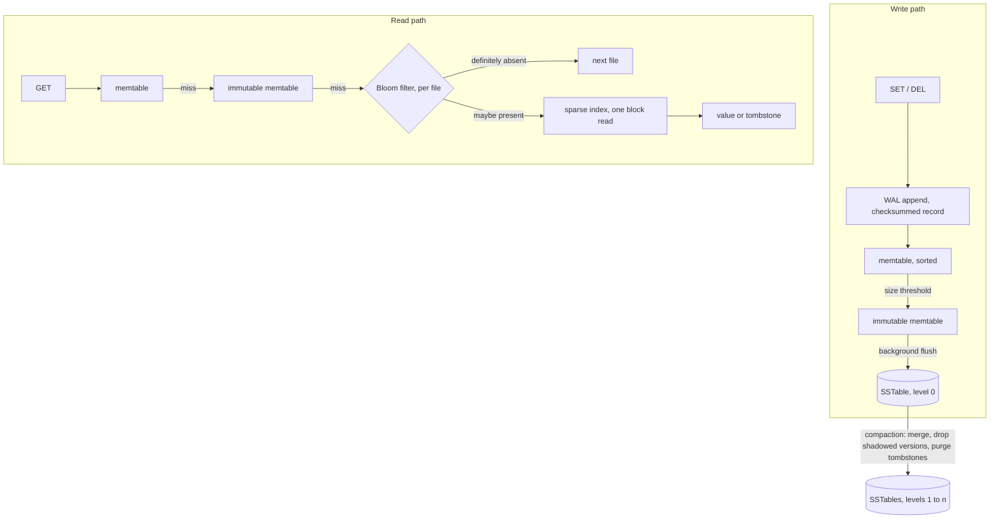

# lsm-kv-rs

> LSM-tree key-value storage engine in Rust, served over the Redis wire protocol. Write-ahead log, sorted memtable, immutable SSTables with sparse index and Bloom filters, background compaction.

**Status: complete through the eight stages under [Build order](#build-order).** Every performance number below comes with the command that reproduces it and the machine it ran on, and the ones that came out against the design are here too: a lock-free memtable that wins its micro-benchmark by 34x and moves nothing end to end is as much of a result as the optimizations that worked.

## Design

An LSM-tree turns random writes into sequential ones. A write goes to an append-only log and to a sorted in-memory table, never to a random offset inside a large file. When the table fills it is written to disk in a single sequential pass as an immutable sorted file, an SSTable.

Reads pay for that: a key can sit in memory or in any file on disk, so a lookup walks them from newest to oldest. Two structures keep this cheap. A Bloom filter per file answers "definitely absent" without touching the disk, and a sparse index turns a possible hit into one block read instead of a file scan. Deletes write a tombstone instead of erasing anything, and compaction merges files in the background, drops shadowed versions and purges tombstones.

This is the design behind LevelDB, RocksDB and Cassandra. The point here is to build it from primitives: WAL, memtable, on-disk format, Bloom filter, compaction and the protocol parser are hand-written, so the mechanics and their tradeoffs are the deliverable rather than the glue around a storage crate.

## Architecture



The engine is synchronous and owns one data directory. The server layer runs on tokio and drives the engine on a blocking pool, because file I/O blocks regardless and a synchronous engine stays testable and profilable without a runtime.

## Write-ahead log

Every mutation is appended to the log before it becomes visible in memory, so a crash costs nothing that was acknowledged. A record is a checksum, a length, then the key and either a value or a tombstone. The checksum covers the length as well as the payload, so a length corrupted by a partial write is caught instead of being trusted as a size.

Recovery replays the file and stops at the first record that is not complete and intact, which is exactly what a crash in the middle of an append leaves behind. Those trailing bytes are truncated before the log reopens for appending; otherwise every record written after them would sit behind a record replay refuses to read.

### What durability costs

`SyncPolicy` decides when appended bytes are pushed to the device.

- `Always` flushes inside every append: one device round trip per record, appends serialized behind each other.
- `Group` lets appends that arrive while a flush is in flight share the next one, so a single round trip covers everything the concurrent writers appended. The guarantee is identical to `Always`. This is group commit, as in RocksDB and PostgreSQL, and it is the default.
- `Interval` flushes from a background thread. Appends never wait, and a crash loses at most the records written since the last flush.

Apple M4 Pro, 12 cores, macOS 26.5. Keys of 16 bytes, values of 100, each configuration capped at 1M appends or 3 seconds:

    cargo run --release --example wal_bench

| policy | threads | appends | writes | flushes | appends per write | appends per flush | appends/s | mean latency |
|--------|---------|---------|--------|---------|-------------------|-------------------|-----------|--------------|
| always | 1 | 784 | 784 | 785 | 1.0 | 1.0 | 260 | 3846 µs |
| always | 8 | 896 | 896 | 897 | 1.0 | 1.0 | 259 | 30830 µs |
| group | 1 | 784 | 784 | 784 | 1.0 | 1.0 | 261 | 3838 µs |
| group | 8 | 3664 | 791 | 791 | 4.6 | 4.6 | 1179 | 6784 µs |
| interval 10ms | 1 | 1000000 | 2162 | 19 | 462.5 | 52631.6 | 3030703 | 0.33 µs |
| interval 10ms | 8 | 1000000 | 2175 | 42 | 459.8 | 23809.5 | 1481473 | 5.40 µs |

On macOS, `File::sync_data` issues `F_FULLFSYNC`, which drains the drive's own write cache: 3.8 ms per flush here. The same code on Linux calls `fdatasync`, an order of magnitude cheaper, so these are the pessimistic numbers.

Adding writers does nothing for `Always` (261 against 259 appends/s) because every append holds the log while it waits for the device. `Group` is identical with one writer, since there is nothing to share, and 4.5 times faster with eight, at an unchanged guarantee: per-append latency drops from 31 ms to 6.8 ms.

### Batching the writes

The `writes` column above is the result of the one optimization stage 7 was pointed at, and it is worth showing where the pointer came from. Stage 1 measured `Interval` as *slower* with eight writers than with one, and re-measuring it at this cap for the comparison below puts that at 243k against 565k appends per second. Once the device is out of the way, what remains is one `write` syscall per record taken under one append lock. Stage 6 put a second number on the same thing, 192 864 pipelined writes per second over TCP, which is 192 864 syscalls per second.

The profile is where the intuition got corrected. Both profiles below come from the same command, run on either side of the change, since running it today can only show the state today:

    git checkout 3129f4f   # the commit before the batching
    ./scripts/flamegraph-server.sh docs/flamegraph-write-path-before.svg

[The flamegraph before the change](docs/flamegraph-write-path-before.svg), same load, does not say what those two numbers suggest. The `write` syscall itself is 1.5 % of the samples. What holds 96.6 % of them is `__psynch_mutexwait` under `wal::Shared::append`: blocking-pool threads queued on the append lock, waiting for whichever one holds it to come back from its syscall.

That distinction is the reason to take a profile rather than reason about one. The syscall was never expensive on its own, at roughly 3 µs. It was expensive because it sat inside the section every writer passes through, so its cost was paid once per record and then multiplied by everyone waiting behind it. The fix is not to make the write cheaper. It is to take it out of the critical section.

That fix is the same shape as the group commit already there. An append encodes its record into a buffer shared by every writer and returns; whoever owns the next flush writes that whole buffer out in one syscall, then flushes it. A batch of concurrent appends costs one `write` and one `F_FULLFSYNC` rather than one of each per record. The buffer is capped at 64 KiB, so under `Interval`, where nothing else empties it between two background flushes, the window a crash can lose stays bounded in bytes as well as in time.

[The flamegraph after](docs/flamegraph-write-path-after.svg) is the same command on the same machine, on this commit: the append lock wait is down to 8.4 % of samples, and the largest remaining blocks are blocking-pool threads parked with nothing left to do. The two profiles are read as shares and not as counts, because a thread blocked on a lock is sampled exactly like a thread doing work, which is precisely what made the first one legible.

Same machine, same benchmark, same 1M cap, before and after:

| policy | threads | before | after | |
|---------|---------|--------|-------|-|
| always | 1 | 261 | 260 | unchanged |
| always | 8 | 259 | 259 | unchanged |
| group | 1 | 261 | 261 | unchanged |
| group | 8 | 1040 | 1179 | 1.13x |
| interval 10ms | 1 | 564658 | 3030703 | 5.4x |
| interval 10ms | 8 | 242801 | 1481473 | 6.1x |

`Always` and single-writer `Group` are unchanged, which is the check that the change did nothing but remove syscalls: with one record in flight there is no batch to form, and the device flush is 99 % of the cost anyway. Where a batch does form, one write now carries 460 records.

The eight-writer `Group` gain is a side effect worth naming: appends per flush rose from 4.0 to 4.6 without any commit delay being added. A writer that no longer holds the append lock across a syscall releases it sooner, so more writers reach the queue before the round closes. That is a partial answer to the open question stage 1 left, whether a PostgreSQL-style commit delay is needed to fill the rounds.

What did not change is the shape: `Interval` is still slower with eight writers than with one, 1.48M against 3.03M. The syscall is gone from the critical section but the single append lock is not, and that is now the next thing to attack rather than a guess about it.

## Memtable and engine

```rust
use lsmkv::{Config, Engine};

let db = Engine::open("data", Config::default())?;
db.set(b"user:1", b"nicolas")?;
assert_eq!(db.get(b"user:1")?, Some(b"nicolas".to_vec()));
db.delete(b"user:1")?;
```

A write is appended to the log, and only then applied to the sorted in-memory table, so nothing is visible before the sync policy considers it durable. Sorted, because a full table is flushed to disk in one sequential pass and that file has to come out sorted.

Two implementations sit behind one `Memtable` trait, selected by `Config::memtable` and by `--memtable` on the server. A `BTreeMap` behind one `RwLock` is the default; a hand-written lock-free skiplist is the alternative, and the comparison between them is below.

One lock over the whole table rather than shards, because every write already passes through the log's single append lock, which the stage 1 numbers identify as the real serialization point. Sharding the table would optimize the wrong lock, and hash sharding would also cost the global sorted order the flush depends on.

Each entry carries the sequence number the log gave its record, and an entry is replaced only by a higher one. Concurrent writers append to the log in one order and reach the table in another, so without that rule two writers racing on the same key can leave memory holding one value and the log another, and the store would silently change state on restart. The test that pins it down is `memory_and_the_files_agree_after_concurrent_writers`: eight threads write and delete over forty shared keys, flushing several times along the way, then the store is reopened and every key has to read back what it answered before. Sequence numbers also have to continue past what recovery replayed, otherwise a fresh write looks older than the record it replaces.

A delete writes a tombstone instead of erasing the entry, because the key may still live in an older file on disk. The tombstone is what shadows it until compaction drops both.

### The skiplist, and what one lock costs

The skiplist is lock-free and written in safe Rust: `unsafe_code = "deny"` holds across the whole workspace. Nodes live in an arena allocated once, and a link is an index into it rather than an address, which is what an arena allocator reduces a pointer to anyway. Two properties of an LSM memtable are what allow that:

- it never frees a single node, it is dropped whole once its flush is done, so there is nothing to reclaim under readers and no epochs or hazard pointers are needed;
- a published node is never modified, because an overwrite inserts a new version rather than editing the old one, so a reader that reaches a node can read it without synchronizing against anything.

Nodes are ordered by key ascending then by sequence number descending, so the versions of one key sit together with the newest first. A lookup takes the first one it finds, a flush takes the first of each group.

    cargo bench --bench memtable

Keys of 16 bytes, values of 100, inserts timed in batches of 10 000 against a table rebuilt outside the timed section:

| per operation | BTreeMap | skiplist | |
|---------------|----------|----------|-|
| get, hit | 68.8 ns | 139.9 ns | 2.0x slower |
| get, miss | 71.9 ns | 105.8 ns | 1.5x slower |
| insert into an empty table | 141.8 ns | 102.9 ns | 1.4x faster |
| insert into a table of 100k | 187.1 ns | 121.7 ns | 1.5x faster |

Then the measurement the skiplist was written for, an insert while readers hammer the same table:

| readers | BTreeMap | skiplist | |
|---------|----------|----------|-|
| 0 | 195.3 ns | 124.1 ns | 1.6x |
| 1 | 229.0 ns | 149.4 ns | 1.5x |
| 4 | 2.19 µs | 303.7 ns | 7.2x |
| 8 | 11.68 µs | 341.8 ns | **34x** |

Eight readers multiply a `BTreeMap` insert by 60 and a skiplist insert by 2.8. What the `BTreeMap` suffers is not contention in the usual sense, it is the writer being starved: a reader-preferring `RwLock` lets a steady stream of readers hold the shared lock continuously, and the writer waits for a gap between them that never comes. That is the shape a lock-free structure removes, and it removes it.

The reads going the other way is the cost of the trade. A `BTreeMap` node holds its keys contiguously and a lookup walks a handful of cache lines; a skiplist lookup jumps around an arena of several megabytes. The miss row separates the two costs: 105.8 ns to walk the structure and find nothing, so the remaining 34 ns of a hit is copying the value out. The `BTreeMap` walks the same shape in 71.9 ns.

### Why the 34x does not reach the server

A structure that wins its micro-benchmark by 34x and does not win end to end is the more useful result of the two, so here is that measurement, from the same script that compares the server against Redis:

    ./scripts/bench-server.sh

| memtable | SET/s | GET/s | pipelined SET/s | pipelined GET/s |
|----------|-------|-------|-----------------|-----------------|
| BTreeMap | 99502 | 101010 | 714285 | 1694915 |
| skiplist | 96618 | 102040 | 651465 | 1136363 |

Unpipelined the two are level, both near 100k, because neither is what limits that path: a request there costs a syscall, a wakeup and a hop onto the blocking pool, and the memtable operation is under a fraction of a percent of it. The 34x is real and it is spent on something that was never the bottleneck.

Pipelined, the skiplist loses on reads, and the cause is not the 2x lookup. It is the arena. It is sized from the memtable budget at an assumed 96 bytes per entry, so a 4 MiB budget buys about 44 700 nodes. `redis-benchmark` writes entries of about 20 bytes, so those nodes run out at roughly a fifth of the byte budget, and the table is frozen there. Over 200 000 writes across 100 000 keys the skiplist wrote 4 files and 5.3 MB while the `BTreeMap` never flushed at all, so its reads go to disk where the other's are still in memory.

That is the cost of the fixed arena, and it is the honest price of writing the structure without pointers: an arena that cannot grow has to be sized for an entry size chosen in advance, and being wrong costs either memory or early flushes. Sizing it for 20 byte entries instead would take a 4 MiB table to 11 MB of arena.

So the `BTreeMap` stays the default, on the numbers rather than on preference. The skiplist is the right structure for a workload with many concurrent readers over a table that is written to constantly, and this server, at 100k requests per second over one socket, is not that workload yet.

### Why both ship

An implementation that is not the default earns its place or it goes. This one earns it three ways, and none of them is that it was work to write.

It is the second implementation the trait was extracted from. A trait written against one implementation is a guess about what varies; this one was cut where two structures actually differ, and the difference is not where it looked from the `BTreeMap` alone. `approx_bytes` is the example: it reads as key and value bytes until an implementation has a fixed arena, at which point reporting a size is the only lever it has on when the engine freezes it.

It is what makes the numbers above reproducible. Every claim in this README comes with the command that produces it, and `cargo bench --bench memtable` produces both columns or neither.

And it is selectable, not shelved: `--memtable skiplist` on the server, `Config::memtable` in the library. Both run the same test suite, and the skiplist additionally carries the loom models of its linking protocol. If the workload changes, the alternative is a flag rather than a rewrite.

What it is not is a recommendation. On this machine and this workload the `BTreeMap` wins, and that is what the default says.

## Sorted files on disk

A memtable that passes its size limit is frozen and a fresh log is started, then a background thread writes the frozen table out as a sorted file. Writes keep landing in the new table while that happens, which is the point of freezing rather than blocking.

```text
file   := block* filter index footer
block  := record* crc32
record := seq | kind | key_len | key | value_len | value
filter := bloom bits | probes | crc32
index  := key range | (first key of the block, offset, length)* crc32
footer := index and filter offsets and lengths | entry count | crc32 | version | magic
```

Blocks are 4 KiB, the default of LevelDB and RocksDB, because this workload is point lookups: a GET should read one page to return one value, not a chunk sized for scans. The index holds the first key of every block plus the key range of the file, so a lookup rejects the file outright when the key falls outside that range, binary searches the index in memory otherwise, and reads exactly one block. On entries of about 116 bytes that index is roughly 0.7% of the file, and it is loaded once when the file is opened.

The checksum covers a block, which is also the unit of I/O: 4 bytes per 4 KiB, one verification amortized over the tens of records a block holds. Per record it would cost 3.4% of the file and a checksum per record read; per file it could not be verified without reading everything.

Keys are stored whole. Prefix compression pays exactly as much as the key distribution allows and nothing here measures that distribution, so it stays a candidate rather than a plan, and it is listed under [Known limits](#known-limits) with the others.

    cargo bench --bench sstable

A file of 100 000 entries, read back while it is still in the page cache, so this is the cost of the format and not of the device:

| lookup | cost |
|--------|------|
| key present | 2.13 µs |
| key absent, inside the file's key range | 51.8 ns |

The gap is the Bloom filter: an absent key is answered from memory 41 times cheaper than the block read a present key needs.

Those are the numbers after the section below, which is about where the 7.54 µs a present key used to cost actually went.

### Where a warm read actually went

    git checkout e71555a   # before the checksum change below
    ./scripts/flamegraph-server.sh docs/flamegraph-read-path-before.svg 5 read

[The read path profile](docs/flamegraph-read-path-before.svg) runs `redis-benchmark -t get` against a store whose key space is several times its memtable, so the lookups reach the files rather than the table the keys were written to: 3.5 million blocks were read during the five seconds it samples. `SsTable::get` held 34.4 % of the samples, and `read_checked`, which reads one block and verifies it, held 33.5 % of them. Essentially all of a lookup was that one function.

Naming the function is not the same as naming the cost, since the checksum is inlined into it. Taking the lookup apart with benchmarks that each add one step is what does that:

| step | cost | share of a lookup |
|------|------|-------------------|
| range check and Bloom probe, no block read | 94.7 ns | 1.3 % |
| one 4 KiB positional read, buffer reused | 323.8 ns | 4.3 % |
| the same, allocating the buffer as the lookup does | 375.6 ns | 5.0 % |
| the whole lookup | 7.54 µs | |

Everything the design was careful about turned out to be the small part. The positional read that lets concurrent readers share one file handle is 324 ns. The sparse index and the filter that hold a lookup to a single block are 95 ns together. The allocation is 52 ns. What was left was about 7.1 µs, 94 % of a warm lookup, and the profile splits it: 247 samples in `scan_block` against 6554 in the read and its checksum. The checksum was nearly all of it.

Which is not a surprise once stated. The CRC-32 was table driven one byte at a time, and 7.1 µs over 4 KiB is about 7.5 cycles per byte. That is not the table lookup being slow, it is that each step needs the checksum the step before it produced, so a dependency chain of roughly eight cycles runs 4096 times and nothing else can start.

### Breaking the chain

Slice-by-eight keeps one table per byte position in a word. A step reads eight bytes and does eight lookups that do not depend on each other, so they issue together and only the final xor is serial.

The polynomial does not change, so the bytes on disk do not either: a file written by one version reads back under the other. That is worth stating because the alternative does not have the property. `CRC-32C` with the ARM64 `crc32c` instruction is faster still, and it is a different polynomial, so it would be an SSTable format version bump; it also needs `unsafe` for the intrinsic, which is a lint this workspace denies everywhere. Slice-by-eight costs neither, which is why it went first.

`crc32_matches_the_reference_implementation` keeps the byte-at-a-time version as a test and compares the two over every length from 0 to 1024 bytes, so the stride and the tail after it are both covered. Compatibility is checked rather than asserted.

| | before | after | |
|--|--------|-------|-|
| `SsTable::get`, key present | 7.54 µs | 2.13 µs | 3.5x |
| `SsTable::get`, key absent | 94.7 ns | 51.8 ns | 1.8x |
| one 4 KiB positional read | 323.8 ns | 325.9 ns | unchanged |
| the same, allocating | 375.6 ns | 376.0 ns | unchanged |

The absent-key row is the one this change does not explain: that path reads no block and verifies no checksum, and it moved anyway. It is reported because it was measured, not because there is an account of it. The two reads are the control: nothing but the checksum was touched, and they say so. In [the profile afterwards](docs/flamegraph-read-path-after.svg), taken by the same command on this commit, `read_checked` falls from 33.5 % of samples to 3.7 % while `scan_block` holds at 247 samples against 264, which is the same control seen the other way.

End to end, on reads that reach the files, the last section of the same script, run on either side of the change as the profiles were:

    git checkout e71555a   # for the before row
    ./scripts/bench-server.sh

| | GET/s | blocks read |
|--|-------|-------------|
| before | 1012145 | 273305 |
| after | 1351351 | 271967 |

A third faster for the same blocks read. The micro-benchmark says 3.5x and the server says 1.33x, and the profile reconciles them: `Engine::get` was 38.4 % of samples and is now 10.2 %, and removing 28 points of a profile is worth about 1.4x. The rest of a pipelined request is network, RESP and the hop onto the blocking pool, and none of that moved.

### What a crash during a flush must not cost

Three orderings carry the guarantee, each against a failure that would otherwise lose data:

- the file is written under a temporary name and takes its final one only once it is complete and on the device, so a crash mid-flush leaves a file recovery deletes instead of one it would have to trust;
- the directory entry is flushed before any log is unlinked, otherwise a crash could leave neither the log nor the file;
- the logs go last. A crash before that leaves logs whose records already sit in a file, and replaying them is harmless: the memtable they rebuild holds the same values and shadows the file anyway.

### Reading across levels

A lookup walks the active memtable, then the frozen ones, then the files from newest to oldest, and stops at the first level that answers. This is where the three-way answer earns its keep: a value and a tombstone both stop the search, and only "not here" continues to older levels. A key deleted after its value reached a file is exactly that, a tombstone in a newer level shadowing an older file.

Sequence numbers used to restart at 1 once every log had been flushed away, because nothing on disk persisted the counter. The manifest carries it now, and `sequence_numbers_survive_a_store_whose_logs_are_all_flushed` is the test that keeps it that way: a fresh write must never look older than the record it replaces.

## Bloom filters

Every file carries a Bloom filter over its keys, held in memory beside its index. A lookup asks the filter before touching the disk: "no" is certain and skips the file, "maybe" costs one block read. It can never miss a key the file does hold, which is the only property the read path needs of it.

Sizing is 10 bits per key with seven probes, the default of LevelDB. The seven probes come from a single hash per key, split in two halves and combined as `h1 + i * h2` (Kirsch and Mitzenmacher), so a higher probe count costs memory rather than hashing. The hash is FNV-1a finished with the splitmix64 mixer, hand-written like the rest of the LSM path.

    cargo run --release --example bloom_fp

Over 36 000 keys, the number a 4 MiB memtable holds, with 200 000 lookups for keys the filter never saw:

| bits per key | probes | filter | measured | theory |
|--------------|--------|--------|----------|--------|
| 8 | 6 | 35 KiB | 2.15 % | 2.16 % |
| 10 | 7 | 43 KiB | 0.80 % | 0.82 % |
| 12 | 8 | 52 KiB | 0.33 % | 0.31 % |
| 16 | 11 | 70 KiB | 0.05 % | 0.05 % |

The measured rates land on the theory within a few hundredths of a point, and that agreement is the interesting result: it says the hand-written hash distributes well enough for the analysis to apply. A weak hash shows up here as a measured rate above the theoretical one. The choice of 10 bits is where the returns start falling off: 8 bits saves 8 KiB per file and costs 2.7 times the wasted reads, 16 bits spends 27 KiB more to remove another 0.75 % of lookups.

What a probe costs is the other half of that trade:

    cargo bench --bench bloom

| bits per key | probes | probe, key present | probe, key absent |
|--------------|--------|--------------------|-------------------|
| 8 | 6 | 15.9 ns | 26.3 ns |
| 10 | 7 | 17.8 ns | 25.6 ns |
| 16 | 11 | 23.1 ns | 27.3 ns |

Hashing one key is 1.70 ns of that, paid once whatever the probe count. Going from 6 probes to 11 costs 7.2 ns on a present key, about 1.4 ns per extra probe, which is a memory read and not a hash: that is the double hashing doing what it was chosen for, and it means the bits-per-key choice above is a memory decision rather than a CPU one.

One result is not explained yet. An absent key should be the *cheaper* case, since the probe loop stops at the first clear bit instead of running to the end, and it measures slower at 8 and 10 bits per key. The likely cause is that the loop exits at a predictable place on a present key and an unpredictable one on an absent key, but that is a hypothesis, and a hypothesis is not a finding. What the number does settle is the one the read path cares about: rejecting a file costs 26 ns against the 2.13 µs of the block read it saves.

The same run then measures the store itself. It writes 6000 keys in a scattered order so the eleven files that come out overlap in key range instead of partitioning it, which is both what a real workload produces and the case where the filters matter, since every file then has to be consulted:

| block reads with filters | without | removed | per lookup |
|--------------------------|---------|---------|------------|
| 905 | 110000 | 99.18 % | 1.6 µs |

905 block reads against the 902 the theory predicts (11 files times 10 000 lookups times 0.0082), and against the 110 000 a filterless lookup would cost. That is 99.2 % of the read amplification of an absent key removed for 43 KiB of memory per 4 MiB file.

When keys do arrive in order the files partition the key space, and the key range in the footer already rejects them for free. The filter is what covers the case where they do not.

## Compaction

Level 0 holds whatever the flushes produced, so its files overlap and each one costs a lookup: what matters there is how many there are, and four is the trigger. Deeper levels hold files that never overlap, so a lookup consults at most one file per level whatever their number: what matters there is how many bytes the level holds against its budget, which is ten times the budget of the level above. A score per level, how far past its own limit it sits, picks the neediest one, which is how RocksDB chooses.

A compaction merges every file of level 0, or the oldest file of a deeper level, with every file of the level below whose key range it touches. It is a streaming k-way merge, so it holds one block of each input rather than any whole file, and where several inputs carry the same key the highest sequence number wins. The output is cut into files of the memtable size and cannot overlap, since it comes out of a single sorted stream.

### The manifest

The set of live files is recorded in a manifest: the whole state, rewritten into a temporary file and renamed into place. That rename is the commit point of a flush or a compaction. A table the manifest does not name is an orphan a crash left behind, and opening the store deletes it, with the log that fed it still there to replay. A store holding tables with no manifest is refused rather than guessed at: guessing the level and the recency of a file wrong resurrects stale values.

An append-only log of edits, as LevelDB uses, is the alternative. The state here is a few tens of bytes per file, so rewriting it whole costs less than the machinery to replay a log and compact that log in turn, and an atomic rename is a sturdier primitive than the tail of a log.

The manifest also carries the sequence counter, so numbering survives a store whose logs have all been flushed away, and the file numbering, so a crashed compaction cannot hand out a number twice.

### When a tombstone can go

A tombstone is dropped only when no file below the output level could still hold the key, which the manifest answers from the key ranges it already records. Drop one too early and the deleted value comes back from the dead. The test that pins it down is `a_key_deleted_above_a_deep_level_does_not_come_back`: a value pushed down to level 2, then deleted, then its tombstone compacted from level 0 into level 1, where dropping it would uncover the value again.

### What it costs and what it buys

Two stores, same keys, each key written twice so half the data on disk is obsolete. One has its level 0 trigger set out of reach, so nothing is ever compacted; the other is left alone.

    cargo run --release --example compaction

| shape | files per level | on disk | write amplification | space amplification | mean lookup | blocks read for 20 000 absent keys |
|-------|-----------------|---------|---------------------|---------------------|-------------|------------------------------------|
| flushes only | [68] | 5052 KiB | 1.18 | 2.35 | 10.78 µs | 11079 |
| leveled | [0, 9, 29] | 2525 KiB | 3.61 | 1.18 | 8.89 µs | 166 |

Compaction halves the disk footprint, because the obsolete version of every key is gone, and cuts the block reads an absent key costs by 67 times. The flat store's 11079 is what the theory predicts: 68 overlapping files, 20 000 lookups, 0.82 % false positives each, so 11152 expected. The leveled store consults at most one file per level, so its filters have far less to reject.

The price is 3.61 bytes written per byte ingested, against 1.18. That figure grows with the number of level transitions the data crosses, two here; a store deep enough for four would pay roughly twice as much. This is the write amplification a leveled shape is known for, and the reason the choice was argued from our own profile: writes here are limited by the device flush of the log, at 260 to 1179 per second, not by background bandwidth.

Two details worth naming. The 1.18 of the flushes-only store is not 1.00 because every file carries its index, its filter and its framing on top of the entries. And the mean lookup moves far less than the block reads do, because a key that is present is found in one block read either way: what the flat shape wastes is Bloom probes and page cache, not the read that answers.

## Serving the Redis protocol

    make server

The server speaks RESP2 on port 6379, so `redis-cli` and `redis-benchmark` drive it unchanged:

```console
$ redis-cli set user:1 nicolas
OK
$ redis-cli get user:1
"nicolas"
$ redis-cli info
# Server
server:lsmkv
version:0.1.0
proto:2
...
# Engine
files:12
files_per_level:0,9,3
last_sequence:40312
block_reads:166
bytes_written:10465948
```

The command set is `PING`, `GET`, `SET` and `DEL`, plus what the two tools probe when they connect: `COMMAND`, `CONFIG GET`, `HELLO`, `INFO`, `SELECT` and `QUIT`. Anything else gets the error Redis would give rather than a plausible answer this store cannot honour, and that line is drawn on purpose: `SET key value EX 10` is refused rather than silently dropping the expiry, and the Redis data types are absent, which is why the benchmark runs `-t set,get`. `INFO` reports the engine's own counters, the ones the examples above measure. `redis-benchmark` prints `WARNING: Could not fetch server CONFIG` on startup: it asks for parameters this server has none of, and an empty answer is the truthful one.

tokio carries the network, one task per connection, while the store stays synchronous behind `spawn_blocking`. A 3.8 ms device flush on a reactor thread would stall every other connection that thread carries, which is the whole reason the hop exists. The hop is paid per batch and not per command: one read is parsed into as many complete commands as it holds, they run in a single blocking call, and the replies leave in one write.

### Against Redis, same machine, same tool

    ./scripts/bench-server.sh

Apple M4 Pro, macOS 26.5, redis 8.8.1, `redis-benchmark -t set,get -n 20000 -c 50`:

| server | durability of a write | SET/s | GET/s |
|--------|-----------------------|-------|-------|
| redis, default | none, memory only | 130718 | 156250 |
| redis, appendfsync always | `fsync` per write | 6349 | 126582 |
| lsm-kv-rs, interval 10 ms | log flushed every 10 ms | 99009 | 100502 |
| lsm-kv-rs, group commit | device flush per write, shared | 6410 | 98039 |
| lsm-kv-rs, flush per write | device flush per write, serialized | 256 | 100502 |

Read honestly, that table says four things.

Redis is 1.6 times faster on reads and 1.3 times on writes at its default settings, which is what a hash table in memory buys against a log, a memtable and a lookup that may reach a file.

The two rows to compare for durability are `appendfsync always` at 6349 and group commit at 6410, and they do not measure the same guarantee: Redis calls `fsync`, which on macOS may leave the write in the drive's own cache, while `sync_data` here issues `F_FULLFSYNC`, which drains it. Equal throughput for a strictly stronger promise, where before the log batching it was half.

The 256 writes per second of the serialized policy is the 260 the log benchmark measures on its own. The network layer adds nothing measurable, because a 3.8 ms device flush dominates everything else in the path.

And group commit at 6410 writes per second means about 25 appends amortized per device flush with 50 clients, against 4.6 with eight writers in the log benchmark. The batching improves as clients arrive, which is what it is for.

### What pipelining exposes

`redis-benchmark -P 16 -n 200000 -c 50`, interval policy against Redis's default:

| server | SET/s | GET/s |
|--------|-------|-------|
| redis, default | 1550387 | 2380952 |
| lsm-kv-rs, interval 10 ms | 1219512 | 1550387 |

One caveat before reading those, because it cuts against the flattering interpretation as often as the harsh one. Repeated three times, this store's pipelined GET lands at 1.50, 1.53 and 1.54 million, inside one percent. Redis's lands at 1.67, 1.92 and 1.92 million, and the 2.38 above is a fourth. So the gap on reads is somewhere between a tenth and a third depending on which run either side gets, and quoting a single figure for it would be picking one.

What survives that spread is the shape: reads are in the same order as Redis's, which says the batch-per-hop design holds and the read path is not what needs work.

Writes were the interesting number here before stage 7: 192 864 per second, an eight-fold gap, and the reason was one `write` syscall per record under one append lock. Batching those writes closed most of it. At 1.22 million against Redis's 1.55 million the store is within a quarter on writes it is still logging to disk, against a Redis that is not.

## Build order

Each stage lands with its tests before the next one starts.

1. **Write-ahead log** (built): append-only records with a per-record checksum, replayed at startup to rebuild the memtable, with the three sync policies measured above.
2. **Memtable and engine API** (built): sorted in-memory table, `get`, `set` and `delete` with tombstones, backed by the WAL and ordered by its sequence numbers.
3. **Sorted files** (built): writer and reader, 4 KiB blocks, sparse index and footer, log rotation and background flush of a full memtable.
4. **Bloom filters** (built): one per file, so a lookup skips a file that cannot hold the key without touching the disk.
5. **Compaction** (built): manifest, leveled background merge, tombstone purge.
6. **Server** (built): RESP2 subset on tokio, so redis-cli and redis-benchmark drive the engine unchanged.
7. **Benchmarks and profiling** (built): criterion micro-benchmarks, redis-benchmark end to end, flamegraph of the write path, and the log batching it pointed at.
8. **Skiplist memtable** (built): hand-written lock-free skiplist measured against the BTreeMap baseline, with the memtable interface extracted from the two rather than from one.

All eight stages are built. Two optimizations landed after them, both from profiles rather than from the plan: the log batching above and the block checksum below it.

## Known limits

Each of these is measured rather than suspected, and each is here because the measurement did not justify the fix yet.

**The skiplist arena cannot grow.** It is sized from the memtable budget at an assumed 96 bytes per entry, so entries much smaller than that exhaust it before the byte budget is reached and the table is frozen early. Measured at a fifth of the budget on 20 byte entries. Growing it in chunks needs either a lock on the chunk list or the raw pointers the structure exists to avoid, and there is no workload here where the skiplist is ahead end to end to pay for that.

**`CRC-32C` would be faster than slice-by-eight.** The ARM64 `crc32c` instruction consumes 8 bytes per instruction against 8 bytes per eight lookups. It is a different polynomial, so it is an SSTable format version bump, and the intrinsic needs `unsafe` against a lint this workspace denies everywhere. Both costs were worth paying when the checksum was 94 % of a read; at 3.7 % of the profile it is no longer the thing to attack.

**The log still serializes on one append lock.** Batching took the `write` syscall out of that critical section, which is what made `Interval` five times faster, but eight writers are still slower than one, 1.48 million appends per second against 3.03. A leader/follower writer queue is the known answer and it has not been justified: at 100k unpipelined requests per second the lock is not what the server waits on.

**Keys are stored whole in the sorted files.** Prefix compression pays as much as the key distribution allows and nothing here measures that distribution, so it stays a candidate rather than a plan.

## Benchmarking

Four levels, all committed and rerunnable:

- criterion micro-benchmarks isolate one structure at a time: `cargo bench`, reported above.
- the skiplist carries a loom model of its linking protocol, which runs every interleaving of its writers and every ordering the memory model allows:

      LOOM_MAX_BRANCHES=50000 RUSTFLAGS="--cfg loom" cargo test -p lsmkv --lib loom

  The models were checked to fail when the defect they exist for is put back, since a model that cannot fail is not a test.
- each stage ships the measurement that shaped its design as an example anyone can rerun, `cargo run --release --example wal_bench` for the log, `--example compaction` for the levels, `--example bloom_fp` for the filters.
- `redis-benchmark` measures the whole path over TCP with the same tool and flags people point at Redis, so the result can be compared to Redis running on the same machine.

Profiling runs on a release build that keeps its symbols. `./scripts/flamegraph-server.sh [output.svg] [seconds] [write|read]` samples the server under either load with the `sample` tool macOS ships, folds the stacks with inferno and demangles them with rustfilt (`cargo install inferno rustfilt`). No root and no Xcode: cargo-flamegraph would be the usual choice, but its macOS backend now goes through `xctrace`, which needs a full Xcode install rather than the command line tools. The read load populates a key space larger than the memtable first, so the lookups it profiles reach the files, and it reports the blocks it read so the artifact says which path it is of.

Both optimizations in this README were found this way, and both were the same shape: an operation that is cheap in itself, made expensive by where it sits. The `write` syscall was 1.5 % of the write profile and the queue behind it was 96.6 %. The CRC-32 table lookup is a few cycles and the 4096-long dependency chain of them was 94 % of a warm read. Neither was found by reading the code.

Measurements are taken on an Apple M4 Pro, 12 cores, 24 GB unified memory.

## Repository layout

    crates/lsmkv/         storage engine, synchronous, owns one data directory
    crates/lsmkv/src/memtable/  the two in-memory tables behind one trait
    crates/lsmkv/benches/ criterion micro-benchmarks, one file per structure
    crates/lsmkv-server/  RESP2 server on tokio, and the protocol itself
    docs/                 flamegraphs the README cites, before and after each fix
    scripts/              benchmark and profiling drivers
    Makefile              build, test and lint entry points

## Development

Requires a stable Rust toolchain; `rust-toolchain.toml` pins the channel and the components.

    make build       release build
    make server      start the server on port 6379 over ./data
    make test        run the test suite
    make bench       run the criterion micro-benchmarks
    make loom        model check the skiplist under loom
    make lint        rustfmt check, then clippy with warnings denied
    make fmt         format, then apply the clippy fixes

`./scripts/bench-server.sh` compares the server against Redis and needs `redis-benchmark` and `redis-server` on the path (`brew install redis`). `make flamegraph` profiles the server under a write load and needs `cargo install inferno rustfilt`; `./scripts/flamegraph-server.sh docs/out.svg 5 read` profiles the read path instead.

## License

MIT
