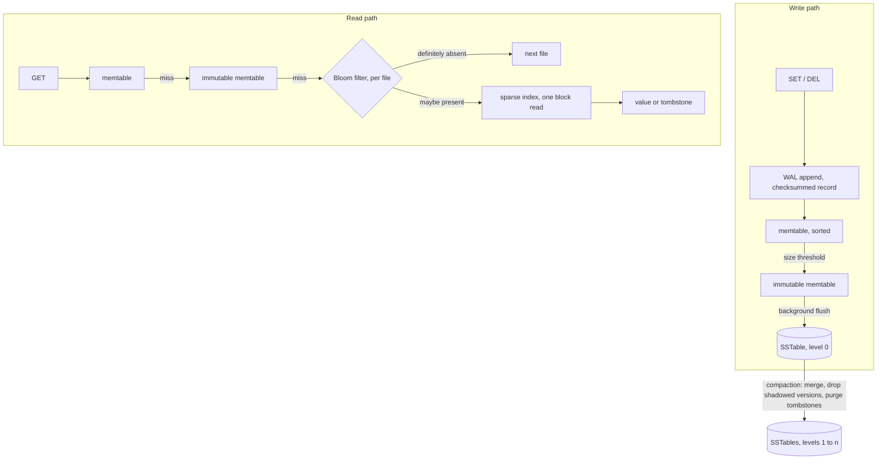

# lsm-kv-rs

> LSM-tree key-value storage engine in Rust, served over the Redis wire protocol. Write-ahead log, sorted memtable, immutable SSTables with sparse index and Bloom filters, background compaction.

**Status: in progress.** The engine is built in the stages listed under [Build order](#build-order), and this README says plainly which ones exist. Performance numbers appear as each stage becomes measurable, always with the command that reproduces them and the machine they ran on.

## Design

An LSM-tree turns random writes into sequential ones. A write goes to an append-only log and to a sorted in-memory table, never to a random offset inside a large file. When the table fills it is written to disk in a single sequential pass as an immutable sorted file, an SSTable.

Reads pay for that: a key can sit in memory or in any file on disk, so a lookup walks them from newest to oldest. Two structures keep this cheap. A Bloom filter per file answers "definitely absent" without touching the disk, and a sparse index turns a possible hit into one block read instead of a file scan. Deletes write a tombstone instead of erasing anything, and compaction merges files in the background, drops shadowed versions and purges tombstones.

This is the design behind LevelDB, RocksDB and Cassandra. The point here is to build it from primitives: WAL, memtable, on-disk format, Bloom filter, compaction and the protocol parser are hand-written, so the mechanics and their tradeoffs are the deliverable rather than the glue around a storage crate.

## Architecture

The engine is synchronous and owns one data directory. The server layer runs on tokio and drives the engine on a blocking pool, because file I/O blocks regardless and a synchronous engine stays testable and profilable without a runtime.

## Write-ahead log

Every mutation is appended to the log before it becomes visible in memory, so a crash costs nothing that was acknowledged. A record is a checksum, a length, then the key and either a value or a tombstone. The checksum covers the length as well as the payload, so a length corrupted by a partial write is caught instead of being trusted as a size.

Recovery replays the file and stops at the first record that is not complete and intact, which is exactly what a crash in the middle of an append leaves behind. Those trailing bytes are truncated before the log reopens for appending; otherwise every record written after them would sit behind a record replay refuses to read.

### What durability costs

`SyncPolicy` decides when appended bytes are pushed to the device.

- `Always` flushes inside every append: one device round trip per record, appends serialized behind each other.
- `Group` lets appends that arrive while a flush is in flight share the next one, so a single round trip covers everything the concurrent writers appended. The guarantee is identical to `Always`. This is group commit, as in RocksDB and PostgreSQL, and it is the default.
- `Interval` flushes from a background thread. Appends never wait, and a crash loses at most the records written since the last flush.

Apple M4 Pro, 12 cores, macOS 26.5. Keys of 16 bytes, values of 100, each configuration capped at 100k appends or 3 seconds:

    cargo run --release --example wal_bench

| policy | threads | appends | flushes | appends per flush | appends/s | mean latency |
|--------|---------|---------|---------|-------------------|-----------|--------------|
| always | 1 | 784 | 785 | 1.0 | 260 | 3844 µs |
| always | 8 | 912 | 913 | 1.0 | 264 | 30316 µs |
| group | 1 | 800 | 800 | 1.0 | 262 | 3815 µs |
| group | 8 | 3200 | 792 | 4.0 | 1036 | 7725 µs |
| interval 10ms | 1 | 100000 | 12 | 8333.3 | 512943 | 2 µs |
| interval 10ms | 8 | 100000 | 23 | 4347.8 | 271031 | 30 µs |

On macOS, `File::sync_data` issues `F_FULLFSYNC`, which drains the drive's own write cache: 3.8 ms per flush here. The same code on Linux calls `fdatasync`, an order of magnitude cheaper, so these are the pessimistic numbers.

Adding writers does nothing for `Always` (260 to 264 appends/s) because every append holds the log while it waits for the device. `Group` is identical with one writer, since there is nothing to share, and 3.9 times faster with eight, at an unchanged guarantee: per-append latency drops from 30 ms to 7.7 ms.

Two results are worth more than the headline. Group commit batches 4 appends per flush where 8 are available, because the writer that owns a round starts the next flush before the writers it just released have queued their next record; holding a round open for a few microseconds, the commit delay of PostgreSQL, should close that gap and will be measured rather than assumed. And `Interval` is slower with eight writers than with one (271k against 513k appends/s): once the device is out of the way, the single append lock and its one write syscall per record become the bottleneck. That is the first thing the profiling stage will look at.

## Build order

Each stage lands with its tests before the next one starts.

1. **Write-ahead log** (built): append-only records with a per-record checksum, replayed at startup to rebuild the memtable, with the three sync policies measured above.
2. **Memtable and engine API**: sorted in-memory table behind a trait, `get`, `set` and `delete` with tombstones, backed by the WAL.
3. **SSTable**: writer and reader, sorted blocks, sparse index and footer at the end of the file, background flush of a full memtable.
4. **Read path**: memtable, then immutable memtable, then files from newest to oldest, with a Bloom filter per file.
5. **Compaction**: background merge, tombstone purge, manifest describing the live set of files.
6. **Server**: RESP2 subset on tokio, so redis-cli and redis-benchmark drive the engine unchanged.
7. **Benchmarks and profiling**: criterion micro-benchmarks, redis-benchmark end to end, flamegraph of the hot path.
8. **Skiplist memtable**: hand-written concurrent skiplist measured against the BTreeMap baseline.

Current stage: 2.

## Benchmarking

Two levels, both committed and rerunnable:

- criterion micro-benchmarks isolate one structure at a time: memtable insert and lookup under concurrent readers, SSTable block read, Bloom filter false positive rate against its bit budget.
- `redis-benchmark` measures the whole path over TCP with the same tool and flags people point at Redis, so the result can be compared to Redis running on the same machine.

On top of those, each stage ships the measurement that shaped its design as an example anyone can rerun, `cargo run --release --example wal_bench` for the log.

Profiling uses cargo-flamegraph on a release build that keeps its symbols. A flamegraph that motivated an optimization is committed under `docs/`, next to the numbers it explains.

Measurements are taken on an Apple M4 Pro, 12 cores, 24 GB unified memory.

## Repository layout

    crates/lsmkv/    storage engine, synchronous, owns one data directory
    Makefile         build, test and lint entry points

## Development

Requires a stable Rust toolchain; `rust-toolchain.toml` pins the channel and the components.

    make build    release build
    make test     run the test suite
    make lint     rustfmt check, then clippy with warnings denied
    make fmt      format, then apply the clippy fixes

## License

MIT
