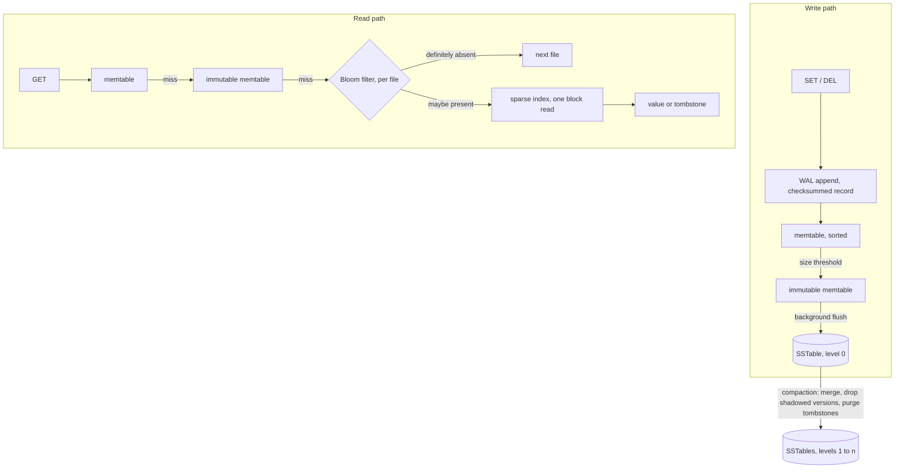

# lsm-kv-rs

> LSM-tree key-value storage engine in Rust, served over the Redis wire protocol. Write-ahead log, sorted memtable, immutable SSTables with sparse index and Bloom filters, background compaction.

**Status: in progress.** The engine is built in the stages listed under [Build order](#build-order), and this README says plainly which ones exist. Performance numbers appear as each stage becomes measurable, always with the command that reproduces them and the machine they ran on.

## Design

An LSM-tree turns random writes into sequential ones. A write goes to an append-only log and to a sorted in-memory table, never to a random offset inside a large file. When the table fills it is written to disk in a single sequential pass as an immutable sorted file, an SSTable.

Reads pay for that: a key can sit in memory or in any file on disk, so a lookup walks them from newest to oldest. Two structures keep this cheap. A Bloom filter per file answers "definitely absent" without touching the disk, and a sparse index turns a possible hit into one block read instead of a file scan. Deletes write a tombstone instead of erasing anything, and compaction merges files in the background, drops shadowed versions and purges tombstones.

This is the design behind LevelDB, RocksDB and Cassandra. The point here is to build it from primitives: WAL, memtable, on-disk format, Bloom filter, compaction and the protocol parser are hand-written, so the mechanics and their tradeoffs are the deliverable rather than the glue around a storage crate.

## Architecture



The engine is synchronous and owns one data directory. The server layer runs on tokio and drives the engine on a blocking pool, because file I/O blocks regardless and a synchronous engine stays testable and profilable without a runtime.

## Write-ahead log

Every mutation is appended to the log before it becomes visible in memory, so a crash costs nothing that was acknowledged. A record is a checksum, a length, then the key and either a value or a tombstone. The checksum covers the length as well as the payload, so a length corrupted by a partial write is caught instead of being trusted as a size.

Recovery replays the file and stops at the first record that is not complete and intact, which is exactly what a crash in the middle of an append leaves behind. Those trailing bytes are truncated before the log reopens for appending; otherwise every record written after them would sit behind a record replay refuses to read.

### What durability costs

`SyncPolicy` decides when appended bytes are pushed to the device.

- `Always` flushes inside every append: one device round trip per record, appends serialized behind each other.
- `Group` lets appends that arrive while a flush is in flight share the next one, so a single round trip covers everything the concurrent writers appended. The guarantee is identical to `Always`. This is group commit, as in RocksDB and PostgreSQL, and it is the default.
- `Interval` flushes from a background thread. Appends never wait, and a crash loses at most the records written since the last flush.

Apple M4 Pro, 12 cores, macOS 26.5. Keys of 16 bytes, values of 100, each configuration capped at 100k appends or 3 seconds:

    cargo run --release --example wal_bench

| policy | threads | appends | flushes | appends per flush | appends/s | mean latency |
|--------|---------|---------|---------|-------------------|-----------|--------------|
| always | 1 | 800 | 801 | 1.0 | 262 | 3815 µs |
| always | 8 | 912 | 913 | 1.0 | 260 | 30746 µs |
| group | 1 | 800 | 800 | 1.0 | 261 | 3828 µs |
| group | 8 | 3200 | 796 | 4.0 | 1036 | 7722 µs |
| interval 10ms | 1 | 100000 | 12 | 8333.3 | 518361 | 2 µs |
| interval 10ms | 8 | 100000 | 23 | 4347.8 | 265941 | 30 µs |

On macOS, `File::sync_data` issues `F_FULLFSYNC`, which drains the drive's own write cache: 3.8 ms per flush here. The same code on Linux calls `fdatasync`, an order of magnitude cheaper, so these are the pessimistic numbers.

Adding writers does nothing for `Always` (262 against 260 appends/s) because every append holds the log while it waits for the device. `Group` is identical with one writer, since there is nothing to share, and just under four times faster with eight, at an unchanged guarantee: per-append latency drops from 31 ms to 7.7 ms.

Two results are worth more than the headline. Group commit batches 4 appends per flush where 8 are available, because the writer that owns a round starts the next flush before the writers it just released have queued their next record; holding a round open for a few microseconds, the commit delay of PostgreSQL, should close that gap and will be measured rather than assumed. And `Interval` is slower with eight writers than with one (266k against 518k appends/s): once the device is out of the way, the single append lock and its one write syscall per record become the bottleneck. That is the first thing the profiling stage will look at.

## Memtable and engine

```rust
use lsmkv::{Config, Engine};

let db = Engine::open("data", Config::default())?;
db.set(b"user:1", b"nicolas")?;
assert_eq!(db.get(b"user:1")?, Some(b"nicolas".to_vec()));
db.delete(b"user:1")?;
```

A write is appended to the log, and only then applied to the sorted in-memory table, so nothing is visible before the sync policy considers it durable. The table is a `BTreeMap` behind one `RwLock`: readers run concurrently, writers take turns. Sorted, because a full table is flushed to disk in one sequential pass and that file has to come out sorted.

One lock over the whole table rather than shards, because every write already passes through the log's single append lock, which the stage 1 numbers identify as the real serialization point. Sharding the table would optimize the wrong lock, and hash sharding would also cost the global sorted order the flush depends on.

Each entry carries the sequence number the log gave its record, and an entry is replaced only by a higher one. Concurrent writers append to the log in one order and reach the table in another, so without that rule two writers racing on the same key can leave memory holding one value and the log another, and the store would silently change state on restart. The test that pins it down is `memory_and_the_files_agree_after_concurrent_writers`: eight threads write and delete over forty shared keys, flushing several times along the way, then the store is reopened and every key has to read back what it answered before. Sequence numbers also have to continue past what recovery replayed, otherwise a fresh write looks older than the record it replaces.

A delete writes a tombstone instead of erasing the entry, because the key may still live in an older file on disk. The tombstone is what shadows it until compaction drops both.

## Sorted files on disk

A memtable that passes its size limit is frozen and a fresh log is started, then a background thread writes the frozen table out as a sorted file. Writes keep landing in the new table while that happens, which is the point of freezing rather than blocking.

```text
file   := block* filter index footer
block  := record* crc32
record := seq | kind | key_len | key | value_len | value
filter := bloom bits | probes | crc32
index  := key range | (first key of the block, offset, length)* crc32
footer := index and filter offsets and lengths | entry count | crc32 | version | magic
```

Blocks are 4 KiB, the default of LevelDB and RocksDB, because this workload is point lookups: a GET should read one page to return one value, not a chunk sized for scans. The index holds the first key of every block plus the key range of the file, so a lookup rejects the file outright when the key falls outside that range, binary searches the index in memory otherwise, and reads exactly one block. On entries of about 116 bytes that index is roughly 0.7% of the file, and it is loaded once when the file is opened.

The checksum covers a block, which is also the unit of I/O: 4 bytes per 4 KiB, one verification amortized over the tens of records a block holds. Per record it would cost 3.4% of the file and a checksum per record read; per file it could not be verified without reading everything.

Keys are stored whole. Prefix compression pays exactly as much as the key distribution allows and there is no measurement yet, so it is a candidate for the profiling stage, with file size and lookup latency measured before and after rather than assumed.

### What a crash during a flush must not cost

Three orderings carry the guarantee, each against a failure that would otherwise lose data:

- the file is written under a temporary name and takes its final one only once it is complete and on the device, so a crash mid-flush leaves a file recovery deletes instead of one it would have to trust;
- the directory entry is flushed before any log is unlinked, otherwise a crash could leave neither the log nor the file;
- the logs go last. A crash before that leaves logs whose records already sit in a file, and replaying them is harmless: the memtable they rebuild holds the same values and shadows the file anyway.

### Reading across levels

A lookup walks the active memtable, then the frozen ones, then the files from newest to oldest, and stops at the first level that answers. This is where the three-way answer earns its keep: a value and a tombstone both stop the search, and only "not here" continues to older levels. A key deleted after its value reached a file is exactly that, a tombstone in a newer level shadowing an older file.

One limitation worth naming: sequence numbers restart at 1 once every log has been flushed away, because nothing on disk persists the counter. It costs nothing today, since the level a value sits in decides whether it wins rather than the number it carries. The manifest of stage 5 is where that counter gets written down.

## Bloom filters

Every file carries a Bloom filter over its keys, held in memory beside its index. A lookup asks the filter before touching the disk: "no" is certain and skips the file, "maybe" costs one block read. It can never miss a key the file does hold, which is the only property the read path needs of it.

Sizing is 10 bits per key with seven probes, the default of LevelDB. The seven probes come from a single hash per key, split in two halves and combined as `h1 + i * h2` (Kirsch and Mitzenmacher), so a higher probe count costs memory rather than hashing. The hash is FNV-1a finished with the splitmix64 mixer, hand-written like the rest of the LSM path.

    cargo run --release --example bloom_fp

Over 36 000 keys, the number a 4 MiB memtable holds, with 200 000 lookups for keys the filter never saw:

| bits per key | probes | filter | measured | theory |
|--------------|--------|--------|----------|--------|
| 8 | 6 | 35 KiB | 2.15 % | 2.16 % |
| 10 | 7 | 43 KiB | 0.80 % | 0.82 % |
| 12 | 8 | 52 KiB | 0.33 % | 0.31 % |
| 16 | 11 | 70 KiB | 0.05 % | 0.05 % |

The measured rates land on the theory within a few hundredths of a point, and that agreement is the interesting result: it says the hand-written hash distributes well enough for the analysis to apply. A weak hash shows up here as a measured rate above the theoretical one. The choice of 10 bits is where the returns start falling off: 8 bits saves 8 KiB per file and costs 2.7 times the wasted reads, 16 bits spends 27 KiB more to remove another 0.75 % of lookups.

The same run then measures the store itself. It writes 6000 keys in a scattered order so the eleven files that come out overlap in key range instead of partitioning it, which is both what a real workload produces and the case where the filters matter, since every file then has to be consulted:

| block reads with filters | without | removed | per lookup |
|--------------------------|---------|---------|------------|
| 905 | 110000 | 99.18 % | 1.6 µs |

905 block reads against the 902 the theory predicts (11 files times 10 000 lookups times 0.0082), and against the 110 000 a filterless lookup would cost. That is 99.2 % of the read amplification of an absent key removed for 43 KiB of memory per 4 MiB file.

When keys do arrive in order the files partition the key space, and the key range in the footer already rejects them for free. The filter is what covers the case where they do not.

## Build order

Each stage lands with its tests before the next one starts.

1. **Write-ahead log** (built): append-only records with a per-record checksum, replayed at startup to rebuild the memtable, with the three sync policies measured above.
2. **Memtable and engine API** (built): sorted in-memory table, `get`, `set` and `delete` with tombstones, backed by the WAL and ordered by its sequence numbers.
3. **Sorted files** (built): writer and reader, 4 KiB blocks, sparse index and footer, log rotation and background flush of a full memtable.
4. **Bloom filters** (built): one per file, so a lookup skips a file that cannot hold the key without touching the disk.
5. **Compaction**: background merge, tombstone purge, manifest describing the live set of files.
6. **Server**: RESP2 subset on tokio, so redis-cli and redis-benchmark drive the engine unchanged.
7. **Benchmarks and profiling**: criterion micro-benchmarks, redis-benchmark end to end, flamegraph of the hot path.
8. **Skiplist memtable**: hand-written concurrent skiplist measured against the BTreeMap baseline. The memtable interface is extracted then, from two implementations rather than from one.

Current stage: 5.

## Benchmarking

Two levels, both committed and rerunnable:

- criterion micro-benchmarks isolate one structure at a time: memtable insert and lookup under concurrent readers, SSTable block read, Bloom filter probe cost.
- `redis-benchmark` measures the whole path over TCP with the same tool and flags people point at Redis, so the result can be compared to Redis running on the same machine.

On top of those, each stage ships the measurement that shaped its design as an example anyone can rerun, `cargo run --release --example wal_bench` for the log.

Profiling uses cargo-flamegraph on a release build that keeps its symbols. A flamegraph that motivated an optimization is committed under `docs/`, next to the numbers it explains.

Measurements are taken on an Apple M4 Pro, 12 cores, 24 GB unified memory.

## Repository layout

    crates/lsmkv/    storage engine, synchronous, owns one data directory
    Makefile         build, test and lint entry points

## Development

Requires a stable Rust toolchain; `rust-toolchain.toml` pins the channel and the components.

    make build    release build
    make test     run the test suite
    make lint     rustfmt check, then clippy with warnings denied
    make fmt      format, then apply the clippy fixes

## License

MIT
