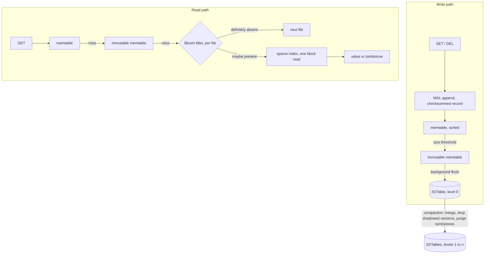

# lsm-kv-rs

> LSM-tree key-value storage engine in Rust, served over the Redis wire protocol. Write-ahead log, sorted memtable, immutable SSTables with sparse index and Bloom filters, background compaction.

**Status: in progress.** The engine is built in the stages listed under [Build order](#build-order), and this README says plainly which ones exist. Performance numbers appear as each stage becomes measurable, always with the command that reproduces them and the machine they ran on.

## Design

An LSM-tree turns random writes into sequential ones. A write goes to an append-only log and to a sorted in-memory table, never to a random offset inside a large file. When the table fills it is written to disk in a single sequential pass as an immutable sorted file, an SSTable.

Reads pay for that: a key can sit in memory or in any file on disk, so a lookup walks them from newest to oldest. Two structures keep this cheap. A Bloom filter per file answers "definitely absent" without touching the disk, and a sparse index turns a possible hit into one block read instead of a file scan. Deletes write a tombstone instead of erasing anything, and compaction merges files in the background, drops shadowed versions and purges tombstones.

This is the design behind LevelDB, RocksDB and Cassandra. The point here is to build it from primitives: WAL, memtable, on-disk format, Bloom filter, compaction and the protocol parser are hand-written, so the mechanics and their tradeoffs are the deliverable rather than the glue around a storage crate.

## Architecture

The engine is synchronous and owns one data directory. The server layer runs on tokio and drives the engine on a blocking pool, because file I/O blocks regardless and a synchronous engine stays testable and profilable without a runtime.

## Build order

Each stage lands with its tests before the next one starts.

1. **Write-ahead log**: append-only records with a per-record checksum, replayed at startup to rebuild the memtable. Recovery stops at the first torn record, which is what a crash in the middle of a write leaves behind.
2. **Memtable and engine API**: sorted in-memory table behind a trait, `get`, `set` and `delete` with tombstones, backed by the WAL.
3. **SSTable**: writer and reader, sorted blocks, sparse index and footer at the end of the file, background flush of a full memtable.
4. **Read path**: memtable, then immutable memtable, then files from newest to oldest, with a Bloom filter per file.
5. **Compaction**: background merge, tombstone purge, manifest describing the live set of files.
6. **Server**: RESP2 subset on tokio, so redis-cli and redis-benchmark drive the engine unchanged.
7. **Benchmarks and profiling**: criterion micro-benchmarks, redis-benchmark end to end, flamegraph of the hot path.
8. **Skiplist memtable**: hand-written concurrent skiplist measured against the BTreeMap baseline.

Current stage: 1.

## Benchmarking

Two levels, both committed and rerunnable:

- criterion micro-benchmarks isolate one structure at a time: memtable insert and lookup under concurrent readers, SSTable block read, Bloom filter false positive rate against its bit budget.
- `redis-benchmark` measures the whole path over TCP with the same tool and flags people point at Redis, so the result can be compared to Redis running on the same machine.

Profiling uses cargo-flamegraph on a release build that keeps its symbols. A flamegraph that motivated an optimization is committed under `docs/`, next to the numbers it explains.

Measurements are taken on an Apple M4 Pro, 12 cores, 24 GB unified memory.

## Repository layout

    crates/lsmkv/    storage engine, synchronous, owns one data directory
    Makefile         build, test and lint entry points

## Development

Requires a stable Rust toolchain; `rust-toolchain.toml` pins the channel and the components.

    make build    release build
    make test     run the test suite
    make lint     rustfmt check, then clippy with warnings denied
    make fmt      format, then apply the clippy fixes

## License

MIT
